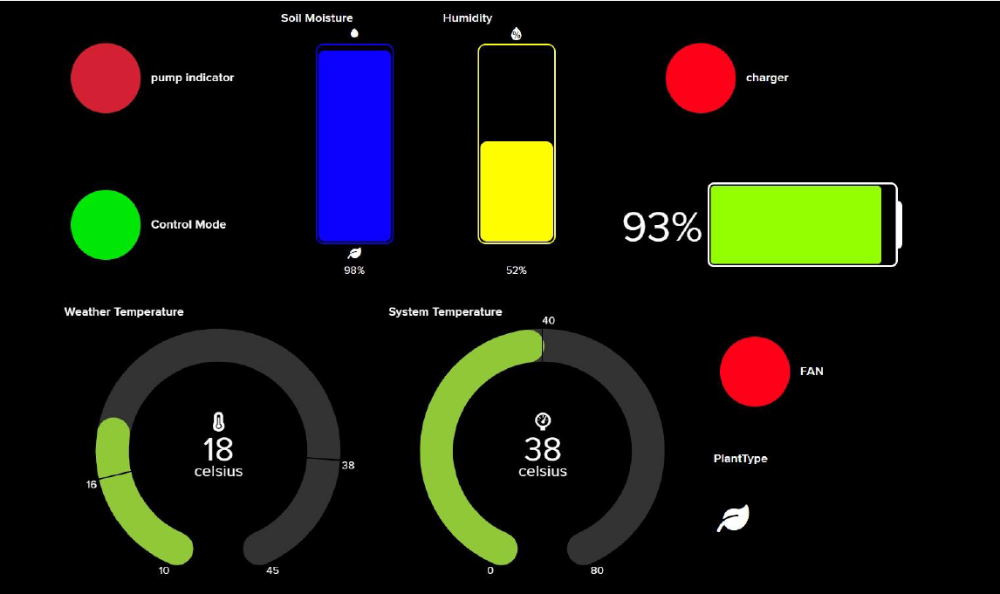

# Smart-Irrigation-IOT_System

```markdown
# 🌿 Smart Irrigation IoT System – *Let it Grow*

**Course:** ECEN430 – Internet of Things  
**Institution:** Nile University  
**Supervisors:** Eng. Bishoy | Eng. Salma Zakzok  
**Team Members:** Salma Hossam, Anas Ayman, Salma AlWardany  

---

## 🧠 Abstract

Water plays a critical role in plant physiology, yet incorrect irrigation practices such as **overwatering** or **underwatering** cause stress, reduced photosynthesis, and eventual plant death.  
This project presents an **IoT-based Smart Irrigation System** that automates water control by continuously monitoring **soil moisture**, **temperature**, and **humidity** using sensors integrated with a **Raspberry Pi**.  

By leveraging **Blynk** and **Adafruit IO** platforms, the system allows **real-time monitoring and control**, minimizing water waste and optimizing irrigation cycles. The solution integrates **HTTPS**, **MQTT**, and **IPC message queues** to connect multiple services securely and efficiently.

---

## 🧩 Problem Statement

Traditional irrigation systems rely on fixed schedules, often ignoring soil and environmental conditions.  
This leads to:
- Excess water usage and energy consumption  
- Plant dehydration due to delayed watering  
- Limited monitoring and manual intervention  

Thus, there is a need for a **low-cost, adaptive irrigation system** capable of responding dynamically to environmental data.

---

## 💡 Project Idea

The **Smart Irrigation IoT System** solves these issues by:
- Continuously sensing **soil moisture**, **humidity**, and **temperature**  
- Automatically activating or deactivating a **water pump** based on threshold levels  
- Providing users with remote **manual control** through a **Blynk mobile app**  
- Visualizing sensor data and system status on an **Adafruit IO dashboard**

This setup allows plants to receive **precisely the amount of water needed**, conserving both water and power resources.

---

## ⚙️ System Architecture

### Hardware–Software Overview
- **Hardware Layer:** Raspberry Pi Zero, DHT11, Soil Moisture Sensor, Relay Module, 12 V Pump, Battery (12 V 10000 mAh)  
- **Software Layer:** Python 3 scripts using HTTPS and MQTT for communication  
- **Cloud Layer:** Adafruit IO Dashboard & Blynk App  
- **Communication Layer:** Message queues (IPC) synchronize control signals between local processes  

### Workflow

1. Sensors gather real-time data (soil moisture, temperature, humidity).  
2. Python script 1 connects to **Blynk App** via **HTTPS**, retrieving user control input.  
3. Python script 2 connects to **Adafruit IO** via **MQTT**, publishing sensor readings and subscribing to control topics.  
4. Both scripts communicate internally via **System V message queues**, enabling synchronization.  
5. The relay activates the water pump automatically or manually depending on the selected mode.


---

## 🔌 Main Components

| Component | Function |
|------------|-----------|
| **Raspberry Pi Zero W** | Main controller and IoT gateway |
| **DHT11 Sensor** | Measures ambient temperature & humidity |
| **Soil Moisture Sensor** | Detects soil hydration level |
| **Relay Module (12 V 10 A)** | Controls the pump circuit |
| **Water Pump (12 V)** | Provides irrigation water |
| **DS1307 RTC Module** | Maintains time data for scheduling |
| **BMS 3S Module & Battery Pack (12 V 10000 mAh)** | Power management |
| **Step-Down Converter (24 V → 5 V)** | Provides regulated power for Pi |
| **Adafruit IO Dashboard** | Web-based visualization |
| **Blynk Mobile App** | Remote control and mode switching |


---

## 🛰️ Communication Protocols

### 1. HTTPS (Blynk → Raspberry Pi)
- Establishes a secure TCP connection to the Blynk API.  
- Python script authenticates and fetches **button states** for manual/automatic modes.  

### 2. MQTT (Adafruit IO ↔ Raspberry Pi)
- Lightweight pub/sub protocol for IoT messaging.  
- TLS encryption ensures data integrity.  
- Raspberry Pi acts as **MQTT client**, publishing sensor readings and subscribing to feedback topics.

### 3. IPC Message Queues
- Used for inter-process communication between the Blynk and Adafruit scripts.  
- Kernel-managed queues allow asynchronous data exchange without shared memory.

---

## 🧱 Implementation

### Repository Structure
```

Smart-Irrigation-IoT/
│
├── adafruit_script.py
├── blynk_script.py
├── requirements.txt
├── images/
│   ├── workflow.png
│   ├── adafruit_dashboard.png
│   ├── blynk_app.png
│   └── circuit.png
├── README.md
└── LICENSE

````

### Dependencies
```bash
sudo apt update
sudo apt install python3-pip
pip install paho-mqtt requests adafruit-io ipcqueue
````

### Running the System

1. Connect all sensors and modules to the Raspberry Pi.
2. Configure Adafruit IO feeds:

   * `soil_moisture`, `temperature`, `humidity`, `pump_indicator`, `mode_indicator`, `battery_capacity`, `autocharge`, `fan_indicator`
3. Obtain the **Blynk Auth Token** and **Adafruit IO API Key**.
4. Run the scripts:

```bash
python3 blynk_script.py &
python3 adafruit_script.py
```

---

## 📊 Results

| Feed Name          | Description                 |
| ------------------ | --------------------------- |
| `soil_moisture`    | Soil moisture percentage    |
| `humidity`         | Relative humidity           |
| `temperature`      | Ambient temperature         |
| `pump_indicator`   | Pump status (ON/OFF)        |
| `mode_indicator`   | Manual/Automatic mode       |
| `battery_capacity` | Remaining charge percentage |
| `autocharge`       | Battery charging status     |
| `fan_indicator`    | Cooling fan control         |

**Adafruit Dashboard:**


**Blynk Mobile Control:**


**Demonstration Video:**
[Watch the working prototype](https://nileuniversity-my.sharepoint.com/:v:/g/personal/s_alwardany_nu_edu_eg/EdbGMWAUS9NIutiPOjR0QboBighQG1EUESw8bqY_hBorhw?nav=eyJyZWZlcnJhbEluZm8iOnsicmVmZXJyYWxBcHAiOiJPbmVEcml2ZUZvckJ1c2luZXNzIiwicmVmZXJyYWxBcHBQbGF0Zm9ybSI6IldlYiIsInJlZmVycmFsTW9kZSI6InZpZXciLCJyZWZlcnJhbFZpZXciOiJNeUZpbGVzTGlua0NvcHkifX0&e=VzqkZx)

---

## 💰 Cost Analysis

| Component                | Price (L.E)            |
| ------------------------ | ---------------------- |
| Raspberry Pi Zero        | 2200                   |
| Battery (12 V 10000 mAh) | 250                    |
| DS1307 RTC Module        | 210                    |
| Step-Down Converter      | 150                    |
| Relay Module             | 30                     |
| Voltage & Current Sensor | 100                    |
| Waterproof Box           | 110                    |
| Battery Level Indicator  | 60                     |
| Pump                     | 75                     |
| DHT11 Sensor             | 48                     |
| Wiring                   | 70                     |
| Soil Moisture Sensor     | 75                     |
| **Total**                | **3378 L.E ≈ 110 USD** |

---

## 📈 Comparative Evaluation

| System                  | Cost (USD)         | Control        | Watering Logic  | No. of Plants  |
| ----------------------- | ------------------ | -------------- | --------------- | -------------- |
| **Our System**          | 140 (incl. profit) | Manual + Auto  | Sensor-based    | 8 (adjustable) |
| Kollea Automatic System | 50                 | Interval Timer | Fixed Intervals | 8              |
| RAINTPOINT System       | 55                 | Interval Timer | Fixed Intervals | 8              |
| MARS HYDRO Kit          | 140                | Interval Timer | Fixed Intervals | 8              |

Our design provides **real sensor-driven automation**, supporting scalability for indoor and outdoor applications.

---

## 📚 References

1. *The five most common reasons plants die.* Botanium Blog, 2020.
   [https://botanium.se/blogs/the-growing-guide/the-five-most-common-reasons-plants-die](https://botanium.se/blogs/the-growing-guide/the-five-most-common-reasons-plants-die)
2. *Kollea Reliable Automatic Watering System.* Amazon Product Page.
3. *RAINTPOINT Automatic Watering System.* Amazon Product Page.
4. *MARS HYDRO Auto Drip Irrigation Kits.* Amazon Product Page.

---

## 🧾 License

This project is licensed under the **MIT License** – see the [LICENSE](LICENSE) file for details.

---

## 👩‍🔬 Future Improvements

* Integration of **machine-learning models** for predictive watering schedules.
* Solar-powered energy harvesting for sustainable operation.
* Edge AI inference for anomaly detection and environmental forecasting.

---

> *“Smart irrigation systems represent a key intersection between IoT, sustainability, and automation — conserving resources while maintaining plant vitality.”*
> — *Let it Grow Team*

```

---

Would you like me to generate a **ready-to-use Markdown file (`README.md`)** for direct download from this content?
```
